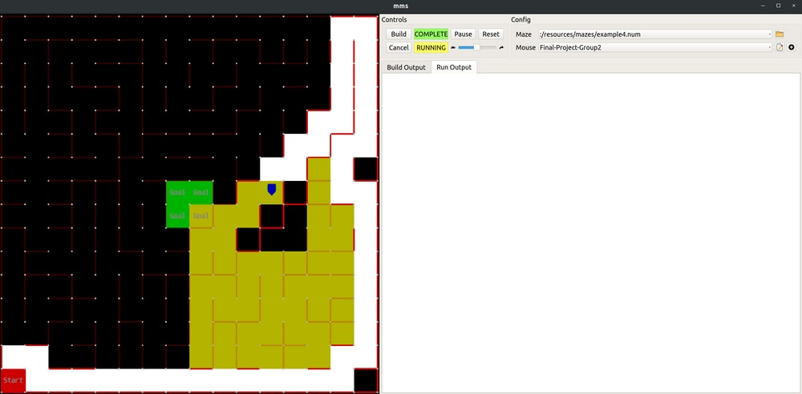
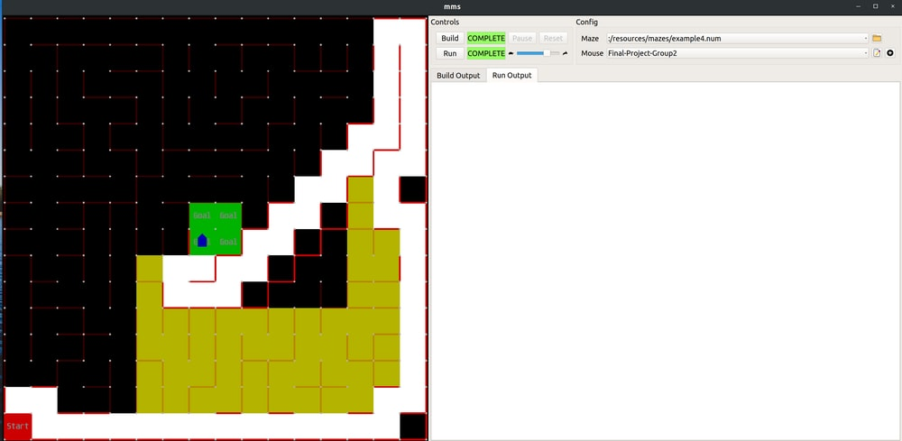
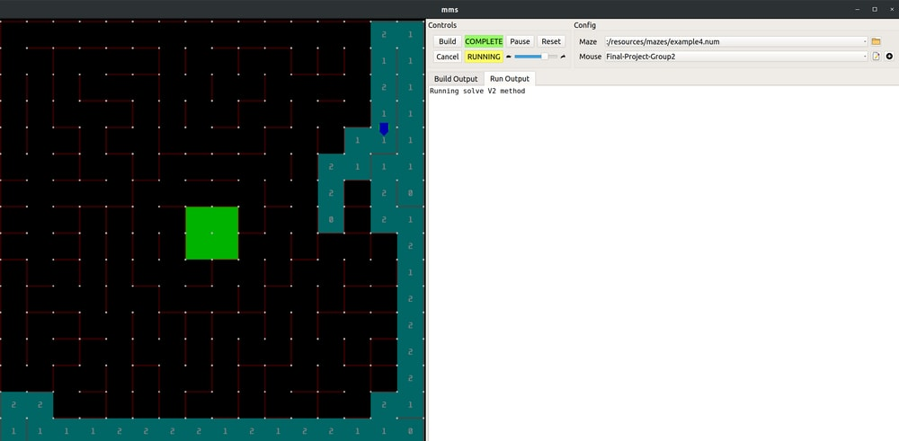
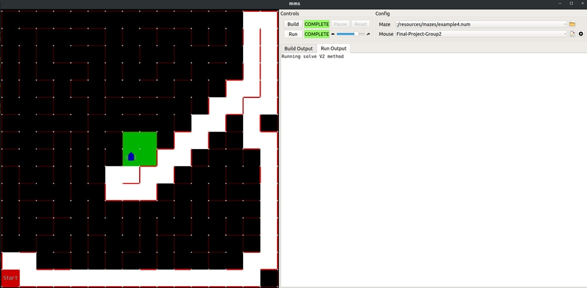

# ENPM 809Y Final Project: Robot Path-planning and simulation using micro-mouse simulator.
# Group 2


Scenario:
========
A robot navigates through a maze to reach the center of the maze.

Objectives:
========
- Write a program that generates a path from the current position (S) of a robot in a maze to the center of
the maze (G).
- The robot that navigates the maze will always be a robot from a derived C ++ class
- Once a path is generated, the robot is tasked to follow the path.
- The micromouse simulator (https://github.com/mackorone/mms) will be used to display the result on
the screen.
- The program exits when either the robot reaches G or there is no solution from S to G.

Maze:
=======

- All mazes have the same dimensions 16 × 16 cells
- All mazes have walls around their perimeter.
- The robot has no knowledge of walls (even the ones around the perimeter) beforehand.
- Walls are discovered only when the robot drives through cells that have walls.
- The coordinate system for all the mazes is displayed in Figure 2.
	- With x ∈ [0, 15] and y ∈ [0, 15]
- Any of the 4 cells that are in the center of the maze constitutes the goal (G) the robot needs to reach. The coordinates of the goal cells are consistent among
mazes:
	– (7,7)
	– (7,8)
	– (8,7)
	– (8,8)
• When the simulation starts, the robot will always start at position (0,0) and will always face north.

-Using `Reset` button will reset stop the program, and it starts fresh when `Run` is pressed again.


To run the code:
========
	1. Navigate to mms/bin
	2. Run the following command: './mms'
	3. Choose one of the mazes available in mazefiles folder.
	4. Select Final_Project/src as the code directory for the algorithm and run the simulator.

		```~/ENPM809Y/Final-Project-Group2/Final-Project-Group2/Final-Project-Group2```

	5. Include this line as build command:
		
		```g++ ./src/API/api.h ./src/API/api.cpp ./src/Maze/maze.h ./src/Maze/maze.cpp ./src/Algorithm/algorithm.h ./src/Algorithm/algorithm.cpp ./src/LandBasedRobot/landbasedrobot.h ./src/LandBasedRobot/landbasedrobot.cpp ./src/LandBasedWheeled/landbasedwheeled.h ./src/LandBasedWheeled/landbasedwheeled.cpp ./main.cpp```

	6. The Run Command : `./a.out`
	7. The implementation provided has two types of algorithms:
		
		--> fp::Algorithm::solve(fp::LandBasedRobot *robot_) ==> Plans the path using DFS and checks for walls while moving along that path. (Psuedo code given in document)
		
		--> fp::Algorithm::solve_V2(fp::LandBasedRobot *robot_) ==> Updates all the walls of the cell the robot is in and then starts exploring using DFS.











Implementation and testing:
=========

The code was generate using Codelite software running on Ubuntu 16.04. Please change the complier options while running it on windows. If you still face problems in running the code please copy the contains of main file into your seperate C++ file.

Documentation files were generated using doxywizard on Ubuntu 16.04, which can be found in Documentation folder. Please run the index.html file in Documentation/html/ folder to see the doxygen output. 

Authors:
=======

	1.Jessica Chen
	2.Saket Gudimetla Hanumath
	3.Carlos Lanza Galeas
	4.Brian Matejevich
	5.Gnyana Teja Samudrala
	6.Sukoon Sarin
	7.Sarvesh Thakur


Thanking you

Group 2
